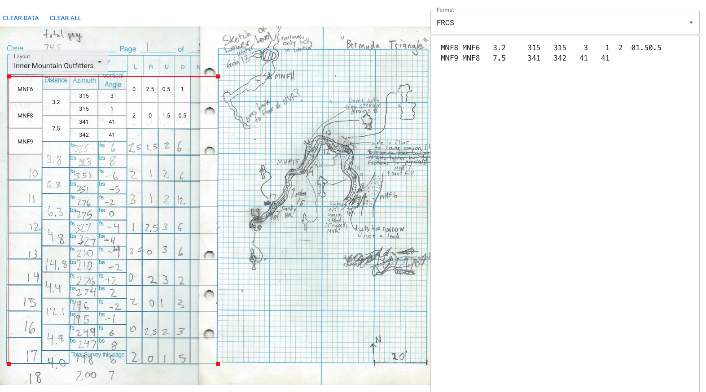

# Cave Survey Data Entry App

https://speleotica.github.io/cave-survey-data-entry

This app makes it easier to enter measurements from cave
surveys written on the typical staggered table style sheets!

# How to use

Just drag and drop image files of your survey notes into the left
pane. After a moment they will appear with a table overlaid outlined
in red. Drag the corners of the red rectangle to fit the table to
the image, then click in the text fields and begin typing in the values.
Use `tab`/`shift + tab` or the arrow keys to go through the fields
quickly.

Once you've entered values, the formatted data will appear in the
right pane. At the moment only the survey data format we use at
Fisher Ridge is supported, but I'll add Compass and Walls soon.
